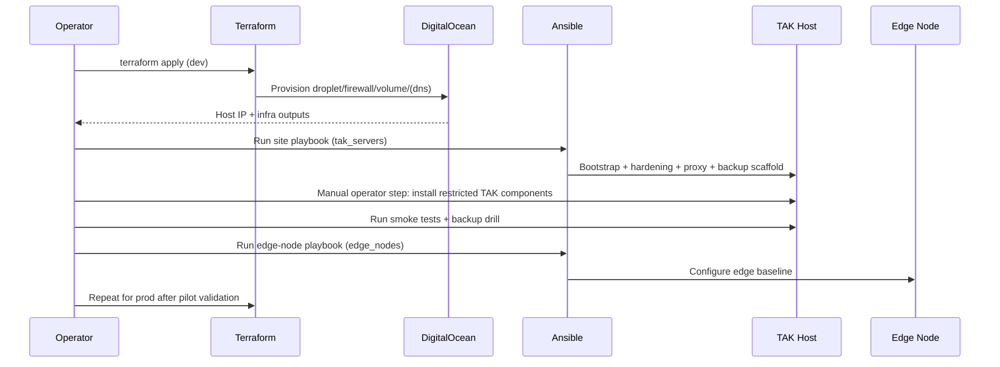

# Deployment Plan

## Deployment sequence diagram

## Phase 1: Provision baseline
- Configure `.env` from `.env.example`.
- Run Terraform in `infra/terraform/environments/dev`.
- Run Ansible `site.yml` against dev inventory with explicit config:
  - `ANSIBLE_CONFIG=infra/ansible/ansible.cfg ansible-playbook -i infra/ansible/inventories/dev/hosts.yml infra/ansible/playbooks/site.yml`

## Phase 2: Install TAK components
- **Manual operator step**: obtain licensed/restricted TAK packages from authorized source.
- **Manual operator step**: transfer packages to `/opt/tak/manual` on host.
- **Manual operator step**: perform vendor-approved install and licensing actions.

## Phase 3: Validate and harden
- Run smoke tests (TCP + HTTPS checks).
- Confirm backup archive + checksum output.
- Perform restore dry-run to staging path (default `/var/tmp/tak-restore`).
- Validate outage-mode SOP and edge node readiness.
- Apply production variables and repeat in prod environment.
