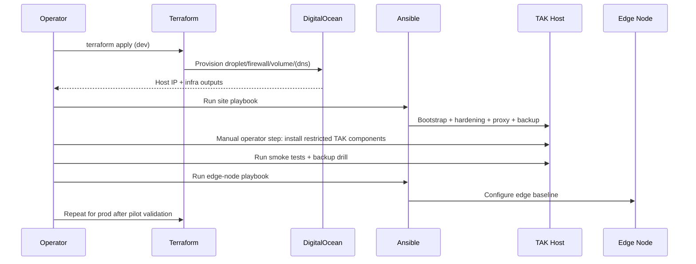

# Deployment Plan

## Deployment sequence diagram

## Phase 1: Provision baseline
- Configure `.env` from `.env.example`.
- Run Terraform in `infra/terraform/environments/dev`.
- Run Ansible `site.yml` against dev inventory.

## Phase 2: Install TAK components
- **Manual operator step**: Obtain licensed/restricted TAK packages from authorized source.
- **Manual operator step**: Transfer packages to `/opt/tak/manual` on host.
- **Manual operator step**: Perform vendor-approved install and licensing actions.

## Phase 3: Validate and harden
- Run smoke tests.
- Confirm backup and restore dry-run.
- Validate outage-mode SOP and edge node readiness.
- Apply production variables and repeat in prod environment.
