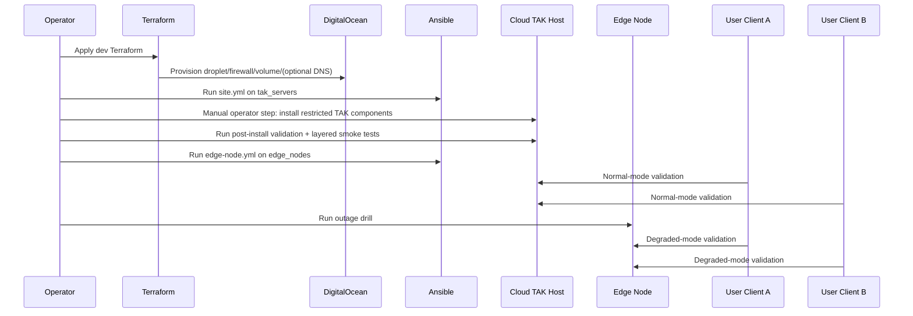

# Deployment Plan

## Deployment sequence diagram

## Exact pilot sequence
1. Validate config and environment values.
2. Terraform apply for dev environment.
3. Ansible site playbook on `tak_servers`.
4. **Manual operator step** install restricted TAK components.
5. Run `scripts/post-install-validate.sh` with your service/path checks.
6. Run layered smoke test.
7. Configure edge nodes via Ansible.
8. Execute lab demo runbook (2 clients).
9. Promote to prod only after documented validation evidence.

## Operator notes
- Keep firewall ports minimal; only open what the pilot transport profile requires.
- Do not enable UDP unless your deployment explicitly requires it.
